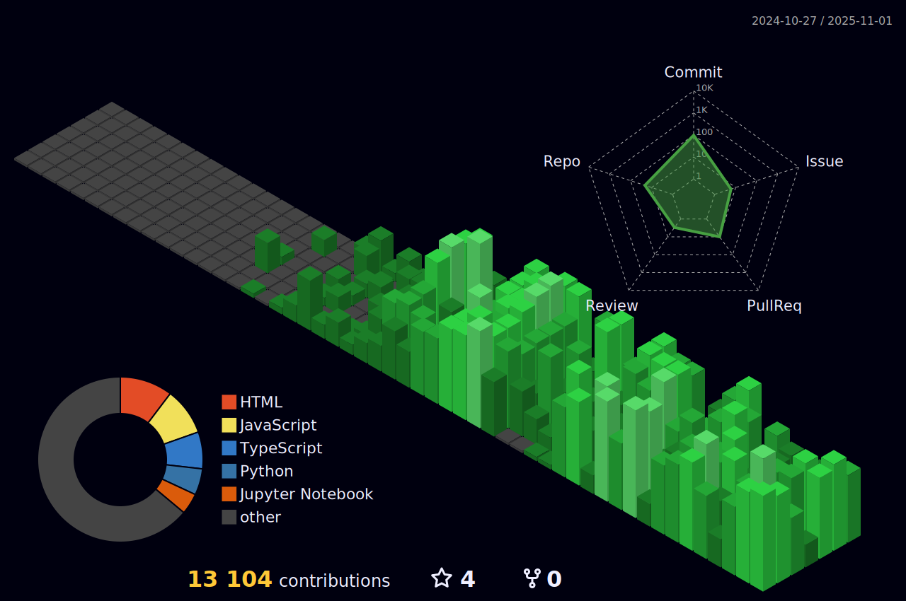

<h1 align="center">Hi there, I'm Qu0rise</h1>

  <em>
    Robotics | Control | Embedded Systems | Machine Learning | MLOps & Data Science | 
    Web Dev (in progress)
  </em>

---

<!--

## GitHub Stats

 
  
  

-->

## About
- **Robotics & Embedded**: C++, ROS, Arduino, Raspberry Pi, Linux  
- **ML & AI**: Python, PyTorch, scikit-learn, TensorFlow, MLOps  
- **Web & Backend**(learning...): Node.js, React, Next.js, NestJS, FastAPI  
- **CAD Tools**: SOLIDWORKS, Fusion 360, NVIDIA Omniverse, iClone8, CC4  
- **Currently Learning**: three.js, Terraform, Supabase, Nuxt.js, MySQL, etc.

---

## Tools & Skills

### 1. Robotics & Embedded

  
  
  
  
  
  
  

### 2. ML & MLOps & Data Science

  
  
  
  
  
  
  
  
  
  

### 3. Web Development

#### 3-1. Frameworks & Libraries

  
  
  
  

#### 3-2. Core Languages & Styling

  
  
  
  
  
  

#### 3-3. Package Managers & Transpilers

  <!-- Package Managers -->
  
  
  

  <!-- Transpilers -->
  
  

#### 3-4. Bundlers & Build Tools

  
  
  
  
  

#### 3-5. Backend as a Service

  
  

### 4. Other Tools

  
  
  
  

### 5. CAD & Visualization

  
  
  
  
  

### 6. Currently Learning

  
  
  
  
  
  
  
  
  
  

---

## Competitions & Certifications

### Data Science Competitions

  
  

### Certifications

  
  

---

<!--  
## GitHub Stats

 
  
  

-->

---

  
    Logos and trademarks are property of their respective owners. This README uses icons solely for identification purposes. 
    JDLA badges are valid only for certified individuals. Kaggle and SIGNATE are external platforms with their own brand guidelines.
  

